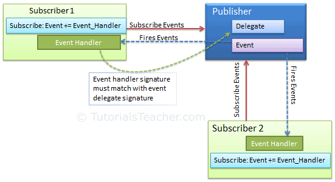

# Events
An event is a **notification sent by an object to signal the occurrence of an action**.

In C#, an **event is an encapsulated delegate**. It is dependent on the delegate. The **delegate defines the signature for the event handler method of the subscriber class**.

## Observer design-pattern
- The class who raises events is called Publisher.
- The class who receives the notification is called Subscriber.

> [!NOTE]
> There can be multiple subscribers of a single event. Typically, a publisher raises an event when some action occurred. The subscribers, who are interested in getting a notification when an action occurred, should register with an event and handle it.



## Declare an event
An event can be declared in two steps:
1. Declare a delegate.
2. Declare a variable of the delegate with event keyword.

### Publisher class
```cs
public delegate void Notify();  //Delegate, specifies the signature for the ProcessCompleted event handler. It specifies that the event handler method in subscriber class must have a void return type and no parameters.
                    
public class ProcessBusinessLogic //Publisher
{
    public event Notify ProcessCompleted; //Event

}

public void StartProcess()
{
    Console.WriteLine("Process Started!");
    // some code here..
    OnProcessCompleted(); //Raise the event
}

protected virtual void OnProcessCompleted() //Protected virtual method
{
    //If ProcessCompleted is not null then call delegate
    ProcessCompleted?.Invoke(); //The ? means: if(ProcessCompleted != null)
}
```

### Subscriber class
The subscriber class must register to ProcessCompleted event and handle it with the method whose signature matches Notify delegate, as shown below.

```cs
class Program
{
    public static void Main()
    {
        ProcessBusinessLogic bl = new ProcessBusinessLogic();
        bl.ProcessCompleted += bl_ProcessCompleted; // register with / subscribe to an event
        bl.StartProcess();
    }

    // event handler
    public static void bl_ProcessCompleted()
    {
        Console.WriteLine("Process Completed!");
    }
}
```

### Another simplified example
```cs
public class Subject
{
    public delegate void Notify();
    public event Notify Observers;

    public void ChangeState()
    {
        Console.WriteLine("State changed!");
        Observers?.Invoke(); // Notify all observers
    }
}

public class Observer
{
    public void OnStateChange() => Console.WriteLine("Observer notified!");
}
```

## Built-in EventHandler Delegate
.NET Framework includes built-in delegate types `EventHandler` and `EventHandler<TEventArgs>` for the most common events. Typically, any event should include two parameters: the source of the event and event data. Use the EventHandler delegate for all events that do not include event data. 

```cs
// declaring an event using built-in EventHandler
public event EventHandler ProcessCompleted;

public void StartProcess()
{
    Console.WriteLine("Process Started!");
    // some code here..
    OnProcessCompleted(EventArgs.Empty); //No event data
}

protected virtual void OnProcessCompleted(EventArgs e)
{
    ProcessCompleted?.Invoke(this, e);
}
```

## Passing event data
Most events send some data to the subscribers. The EventArgs class is the base class for all the event data classes. .NET includes many built-in event data classes such as SerialDataReceivedEventArgs. It follows a naming pattern of ending all event data classes with EventArgs. You can create your custom class for event data by deriving EventArgs class.

```cs
class Program
{
    public static void Main()
    {
        ProcessBusinessLogic bl = new ProcessBusinessLogic();
        bl.ProcessCompleted += bl_ProcessCompleted; // register with an event
        bl.StartProcess();
    }

    // event handler
    public static void bl_ProcessCompleted(object sender, bool IsSuccessful)
    {
        Console.WriteLine("Process " + (IsSuccessful? "Completed Successfully": "failed"));
    }
}

public class ProcessBusinessLogic
{
    // declaring an event using built-in EventHandler
    public event EventHandler<bool> ProcessCompleted; 

    public void StartProcess()
    {
        try
        {
            Console.WriteLine("Process Started!");
			
            // some code here..

            OnProcessCompleted(true);
        }
        catch(Exception ex)
        {
            OnProcessCompleted(false);
        }
    }

    protected virtual void OnProcessCompleted(bool IsSuccessful)
    {
        ProcessCompleted?.Invoke(this, IsSuccessful);
    }
}
```

## User-defined EventArgs
```cs
class ProcessEventArgs : EventArgs
{
    public bool IsSuccessful { get; set; }
    public DateTime CompletionTime { get; set; }
}
```